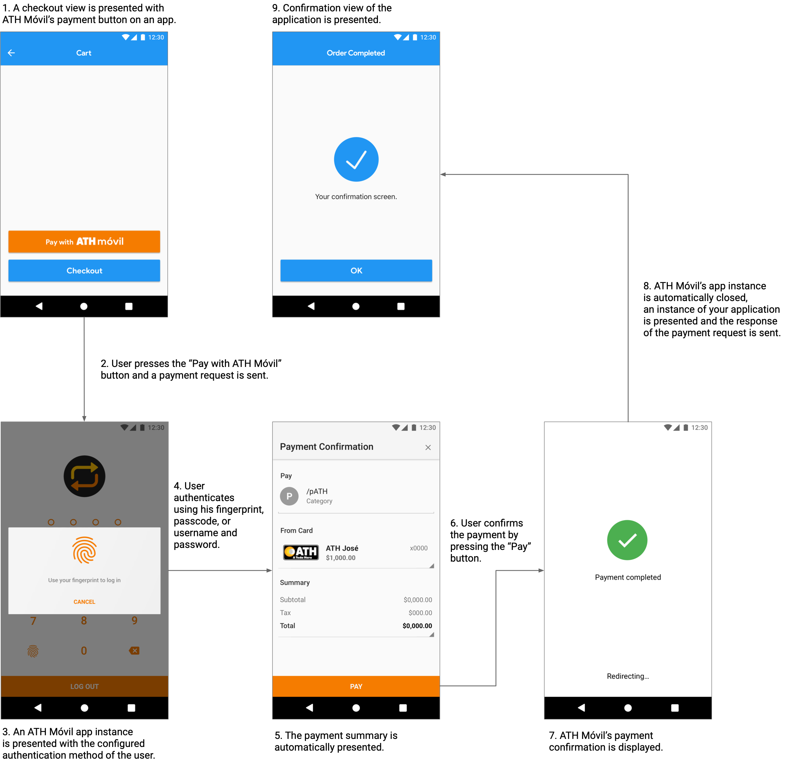

# ATH Móvil Flutter SDK


## Introduction
ATH Móvil's Payment Secure Button SDK provides a simple, secure and fast checkout experience to customers paying on your Flutter application. After integrating our Payment Secure Button on your app you will be able to receive real time payments from more than 1.5 million ATH Móvil users.

Disclaimer: The Payment Button ATH Móvil is not compatible with any major Ecommerce platform. This includes Shopify, Wix, Woocommerce or Stripe.

Disclaimer: We currently **do not** have a **Testing environment**. You need to have an active ATH Business account and a active ATH Móvil account.

## Prerequisites
Before using the ATH Móvil’s payment you need to have:

### ATH Business

1\. An active ATH Business account.

2\. A card registered in your ATH Business profile. 

3\. The public and private key assigned to your business.

For instructions on how to open a ATH Business account please refer to: [ATHB flyer eng letter 1.pdf](https://github.com/user-attachments/files/16267504/ATHB.flyer.eng.letter.1.pdf)

For more information related to ATH Business and how it works please refer to:[ATH BUSINESS_Apr2024.pptx](https://github.com/user-attachments/files/16267585/ATH.BUSINESS_Apr2024.pptx)

### ATH Móvil

To complete the payment for testing purposes you need to have:

1\. An active ATH Móvil account.

2\. A card registered in your ATH Móvil profile. It can not be the same card that is registered in ATH Business.

For more information related to ATH Móvil and how it works please refer to:[ATH Móvil_Apr2024.pptx](https://github.com/user-attachments/files/16267592/ATH.Movil_Apr2024.pptx)


If you need help signing up, adding a card or have any other question please refer to https://athmovilbusiness.com/preguntas or contact our support team at (787) 773-5466. For technical support please complete the following form:  https://forms.gle/ZSeL8DtxVNP2K2iDA.

## Support
If you need help signing up, adding a card or have any other question please refer to https://ath.business.com/preguntas. For technical support please complete the following form:  https://ath.business/botondepago.

## Installation
Before we get started, let’s configure your project:

### Payment Secure Button SDK dependency
Add the Payment Secure Button SDK dependency to your project.
```yaml
dependencies:
  athmsdk: 1.0.0
```

### Dependencies
The Payment Secure Button SDK uses these dependencies.
```yaml
dependencies:
  async: ^2.6.1
  uuid: 3.0.4
  intl: ^0.18.1
```

## Android Installation
Before we get started, let’s configure your Android project:

### Dependencies
Add the Payment Secure Button SDK dependencies to your project.
```java
dependencies {
    implementation 'androidx.annotation:annotation:1.2.0'
    implementation 'com.google.code.gson:gson:2.8.6'
    implementation 'com.squareup.retrofit2:retrofit:2.9.0'
    implementation 'com.squareup.retrofit2:converter-gson:2.9.0'
}
```

### Manifest
Configure the activity where the payment response will be sent to on your manifest.
(**Note: If your app targets Android 11 (API Level 30) or higher, you must include the QUERY_ALL_PACKAGES permission❗️**)

```xml
<uses-permission android:name="android.permission.QUERY_ALL_PACKAGES"/>
...
<activity
    android:name=".Activity">
    <intent-filter>
        <!--Schema with app bundle Configuration-->
        <action android:name="appbundle.schema" />
        <category android:name="android.intent.category.DEFAULT" />
    </intent-filter>
</activity>
```

## iOS Installation
Before we get started, let’s configure your iOS project:

### Pods
Run the pod install command to add the Payment SecureButton SDK dependencies to your project.
```shell script
% pod install
```

### URL Configuration
Add the URL configuration to the .plist file.
```xml
<key>CFBundleURLTypes</key>
    <array>
        <dict>
            <key>CFBundleTypeRole</key>
            <string>Editor</string>
            <key>CFBundleURLName</key>
            <string>*App bundle*</string>
            <key>CFBundleURLSchemes</key>
            <array>
                <string>*App callback schema*</string>
            </array>
        </dict>
    </array>
```

## Usage
To integrate ATH Móvil’s Payment Secure Button to your Flutter application follow these steps:

### Widget
Add the “Pay with ATH Móvil” button as a widget.
```dart
// ATHMovilPaymentSecureButton property enum Style { orange, light, dark }
// ATHMovilPaymentSecureButton property enum Lang { en, es }
ATHMovilPaymentSecureButton(style: Style.orange,
                      lang: Lang.en,
                      athMovilPayment: ATHMovilPayment(), //ATHMovilPayment
                      listener: this,) //ATHMovilPaymentResponseListener
```
* `Style { orange, light, dark }` defines the theme of the button.

| Styles  | Example |
| ------------- |-------------|
| `orange` |  |
| `light` |  |
| `dark` |  |

* `Lang { en, es }` defines the language of the button.

| Languages  | Example |
| ------------- |-------------|
| `english` |  |
| `espanol` |  |

### Flutter
#### Configure the payment.
Add all required imports to the dart file of your checkout screen.
```dart
import 'athmovil_checkout_flutter/interfaces/athmovil_payment_response_listener.dart';
import 'athmovil_checkout_flutter/model/athmovil_payment.dart';
import 'athmovil_checkout_flutter/model/athmovil_payment_response.dart';
import 'athmovil_checkout_flutter/widget/athmovil_payment_secure_button.dart';
```

Create an `ATHMovilPayment` object on the main class of the file.
```dart
ATHMovilPayment(
      businessToken: , //String
      callbackSchema: , //String 
      total: , //double
      subtotal: , //double
      tax: , //double
      timeout: , //int seconds
      metadata1: , //String
      metadata2: , //String
      items: , //ATHMovilItem
      phoneNumber: , //String
    );
```

| Method  | Data Type | Required | Description |
| ------------- |:-------------:|:-----:| ------------- |
| `phoneNumber` | String | Phone number of customer. |
| `businessToken` | String | Yes | Determines the Business account where the payment will be sent to. |
| `callbackSchema` | String | Yes | Android schema configuration name of manifest / iOS URL Schema. |
| `timeout` | Int | No | Expires the payment process if the payment hasn't been completed by the user after the provided amount of time (in seconds). Countdown starts immediately after the user presses the Payment Secure Button. Default value is set to 600 seconds (10 mins). |
| `total` | Double | Yes | Total amount to be paid by the end user. |
| `subtotal` | Double | No | Optional  variable to display the payment subtotal (if applicable) |
| `tax` | Double | No | Optional variable to display the payment tax (if applicable). |
| `metadata1` | String | No | Optional variable to attach data to the payment object. |
| `metadata2` | String | No | Optional variable to attach data to the payment object. |
| `items` | Array | No | Optional variable to display the items that the user is purchasing on ATH Móvil's payment screen. Items on the array are expected in the following order: (“name”, “desc”, "quantity", “price”, “metadata”) |

In the request make sure you comply with the following requirements for `ATHMovilPayment` object, otherwise you will receive an exception on the callback:

| Variable  | Expeted Value |
| ------------- |:-------------:|
| `total` | Positive value |
| `subtotal` | Positive value or zero |
| `tax` | Positive value or zero |
| `metadata1` | Spaces, letters and numbers, max length 40|
| `metadata2` | Spaces, letters and numbers, max length 40|
| `publicToken` | String |
| `timeout` | Integer between 60 and 600 |
| `phoneNumber` | String | Phone number of customer. |

If you provide items in the request make sure you comply with these requirements for the `ATHMovilItem` object:

| Variable  | Expected Value |
| ------------- |:-------------:|
| `name` | Spaces, letters and numbers |
| `price` | Positive value greater than zero |
| `description` | Spaces, letters and numbers |
| `quantity` | Positive value greater than zero |
| `metadata` | Spaces, letters and numbers |

Note the request and items are the same objects in the response `ATHMovilPaymentResponse` so the values and types are identical in request and response, but the response includes the following additional variables:

| Variable  | Data Type | Description |
| ------------- |:-------------:|------------- |
| `dailyTransactionID` | Int | Consecutive of the transaction, when the transaction is cancelled o expired the value will be zero. |
| `referenceNumber` | String | Unique transaction identifier, when the transaction is cancelled o expired the value will be an empty string. |
| `date` | String | Date of Transaction. |
| `name` | String | Name of customer. |
| `phoneNumber` | String | Phone number of customer. |
| `email` | String | Email of customer. |
| `fee` | Double | Fee paid in the transaction. |
| `netAmount` | Double | Total amount paid by the end user without the fee. |
| `status` | String | CANCELLED, COMPLETED or EXPIRED. |

If there is unexpected data in the request or response the SDK will call the closure `onPaymentException` and you will get a title and a message with information of the error. Your application must manage these error cases. For example:

```dart
@override
  void onPaymentException(String error, String description) {
        //handle the error
  }
```
#### Validate the status of Pending Payments.
In some error cases payment responses may not be sent back to your application, for example when end users close the ATH Móvil application from the multitasking view of their device in the middle of the payment process.

To mitigate these cases the button has a method verifies the status of the transaction if the payment process was interrupted. The method can take a maximum of 30 seconds to respond, so consider managing this wait time from a user experience perspective.

#### Handle all payment responses.
When a transaction is completed, canceled or expired a response is sent back to the URL scheme that was configured on the payment. Implement the `ATHMovilPaymentResponseListener` on the activity of the configured scheme.
```dart
class MyApp extends StatelessWidget implements ATHMovilPaymentResponseListener {}
```

Handle the payment response using the following methods:
* Completed
```dart
@override
  void onCompletedPayment(ATHMovilPaymentResponse athMovilPaymentResponse) {
    //Handle response
  }
```

* Cancelled
```dart
@override
  void onCancelledPayment(ATHMovilPaymentResponse athMovilPaymentResponse) {
    //Handle response
  }
```

* Expired
```dart
@override
  void onExpiredPayment(ATHMovilPaymentResponse athMovilPaymentResponse) {
    //Handle response
  }
```

* Failed
```dart
@override
  void onFailedPayment(ATHMovilPaymentResponse athMovilPaymentResponse) {
    //Handle response
  }
```

* Exception
```dart
@override
  void onPaymentException(String error, String description) {
        //handle the error
  }
```

## Testing
To test your Payment Secure Button integration you can make payments in production using the Private and Public tokens of your ATH Móvil Business account or you can use the public token "dummy" to make simulated payments. When you use the token "dummy":
* The ATH Movil production application will simulate a payment.
* No end user credentials need to be provided to interact with the simulated payment.
* Completed, cancelled and expired payments can be tested.

```dart
ATHMovilPayment(
      businessToken: "dummy", //String
      ...
    );
```

## User Experience


## Legal
The use of this API and any related documentation is governed by and must be used in accordance with the Terms and Conditions of Use of ATH Móvi Business ®, which may be found at: https://athmovilbusiness.com/terminos.
