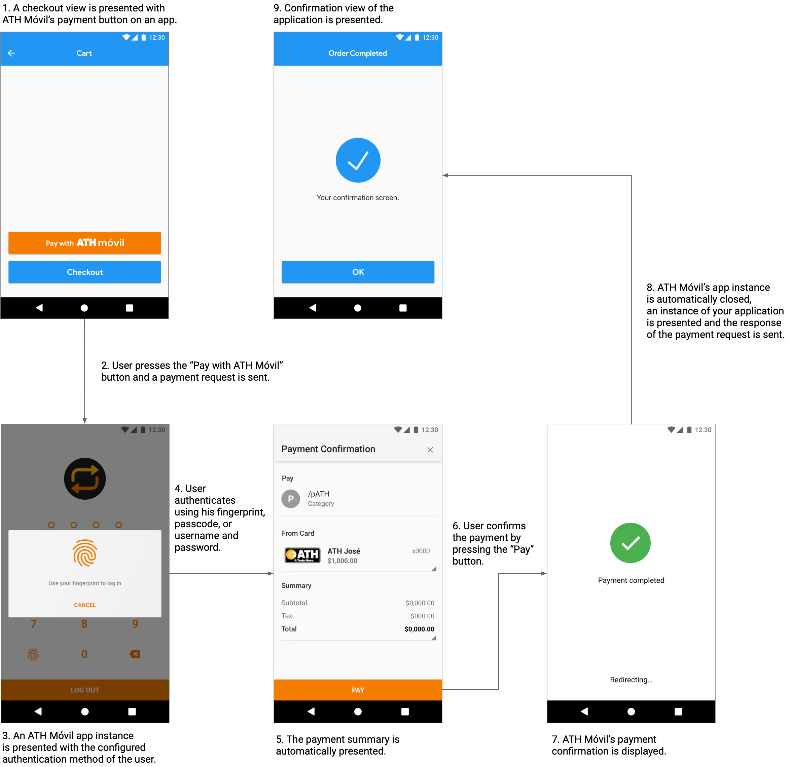

# ATH Móvil Flutter SDK

Flutter plugin for integrating the ATH Móvil Payment Secure Button into Android and iOS applications.

## Introduction

ATH Móvil's Payment Secure Button SDK provides a simple, secure, and fast checkout experience for customers paying in your Flutter application. After integrating the Payment Secure Button, you can receive real-time payments from ATH Móvil users directly in your app.

## Features

- ATH Móvil Checkout integration for Flutter
- Android and iOS support
- Secure payment button widget
- Payment response callbacks
- Simulated payment support using the public dummy token
- Localization support

## Prerequisites

Before you begin, make sure you have:

1. An active ATH Móvil Business account.
2. A registered, verified, and active ATH® card in your Business account.
3. Access to your Business account API keys. These can be found in the **Settings** section of the ATH Móvil Business app.

For help signing up, adding a card, or other questions:

- FAQs: [https://athmovilbusiness.com/preguntas](https://athmovilbusiness.com/preguntas)
- Technical support form: [https://forms.gle/ZSeL8DtxVNP2K2iDA](https://forms.gle/ZSeL8DtxVNP2K2iDA)

## Installation

Add the dependency to your `pubspec.yaml`:

```yaml
dependencies:
  athmovil_checkout_flutter: ^6.0.0
```

### Dependencies
The Payment Secure Button SDK uses these dependencies.
```yaml
dependencies:
  async: ^2.6.1
  uuid: 3.0.4
  intl: ^0.18.1
```

## Android Installation
Before we get started, let’s configure your Android project:

### Dependencies
Add the Payment Secure Button SDK dependencies to your project.
```java
dependencies {
    implementation 'androidx.annotation:annotation:1.2.0'
    implementation 'com.google.code.gson:gson:2.8.6'
    implementation 'com.squareup.retrofit2:retrofit:2.9.0'
    implementation 'com.squareup.retrofit2:converter-gson:2.9.0'
}
```

### Manifest
Configure the activity in your AndroidManifest.xml to receive the payment response.
(**Note: If your app targets Android 11 (API Level 30) or higher, you must include the QUERY_ALL_PACKAGES permission❗️**)

```xml
<uses-permission android:name="android.permission.QUERY_ALL_PACKAGES"/>
...
<activity
    android:name=".MainActivity">
    <intent-filter>
        <action android:name="appbundle.schema" />
        <category android:name="android.intent.category.DEFAULT" />
    </intent-filter>
</activity>
```

## iOS Installation
Before we get started, let’s configure your iOS project:

### Pods
Run the pod install command to add the Payment SecureButton SDK dependencies to your project.
```shell script
% pod install
```

### URL Configuration
Add the URL configuration to the .plist file.
```xml
<key>CFBundleURLTypes</key>
<array>
    <dict>
        <key>CFBundleTypeRole</key>
        <string>Editor</string>
        <key>CFBundleURLName</key>
        <string>YourAppBundle</string>
        <key>CFBundleURLSchemes</key>
        <array>
            <string>YourCallbackSchema</string>
        </array>
    </dict>
</array>
```

### Import the package:
```dart
import 'package:athmovil_checkout_flutter/athmovil_checkout_flutter.dart';
```

## Usage
To integrate ATH Móvil’s Payment Secure Button into your Flutter application, follow these steps:


### Widget
Add the “Pay with ATH Móvil” button as a widget.
```dart
// ATHMovilPaymentSecureButton property enum Style { orange, light, dark }
// ATHMovilPaymentSecureButton property enum Lang { en, es }
ATHMovilPaymentSecureButton(
  buildType: ".qacert",
  athMovilPayment: ...,
  listener: this,
  style: Style.dark,
)
```
* `Style { orange, light, dark }` defines the theme of the button.

| Styles  | Example |
| ------------- |-------------|
| `orange` |  |
| `light` |  |
| `dark` |  |

* `Lang { en, es }` defines the language of the button.

| Languages  | Example |
| ------------- |-------------|
| `english` |  |
| `espanol` |  |

### Flutter
#### Configure the payment.
Add required import to the dart file of your checkout screen.
```dart
import 'package:athmovil_checkout_flutter/athmovil_checkout_flutter.dart';
```

Create an `ATHMovilPayment` object on the main class of the file.
```dart
final payment = ATHMovilPayment(
  businessToken: 'dummy',
  callbackSchema: 'ATHMSDK',
  total: 29.14,
  subtotal: 26.99,
  tax: 2.15,
  timeout: ConstantsUtil.ATHM_MIN_TIMEOUT,
  items: [
    ATHMovilItem(
      name: 'Shirt',
      description: 'Red t-shirt',
      price: 10.99,
      quantity: 1,
      metadata: 'shirt-001',
    ),
    ATHMovilItem(
      name: 'Shoes',
      description: 'Running shoes',
      price: 16.00,
      quantity: 1,
      metadata: 'shoes-001',
    ),
  ],
  phoneNumber: '',
);
```

Use the secure payment button in your widget tree:
```dart
ATHMovilPaymentSecureButton(
  buildType: ".qacert",
  athMovilPayment: payment,
  listener: this,
  style: Style.dark,
)
```

| Method  | Data Type | Required | Description |
| ------------- |:-------------:|:-----:| ------------- |
| `phoneNumber` | String | No |  Phone number of customer. |
| `businessToken` | String | Yes | Determines the Business account where the payment will be sent to. |
| `callbackSchema` | String | Yes | Android schema configuration name of manifest / iOS URL Schema. |
| `timeout` | Int | No | Expires the payment process if the payment hasn't been completed by the user after the provided amount of time (in seconds). Countdown starts immediately after the user presses the Payment Secure Button. Default value is set to 600 seconds (10 mins). |
| `total` | Double | Yes | Total amount to be paid by the end user. |
| `subtotal` | Double | No | Optional  variable to display the payment subtotal (if applicable) |
| `tax` | Double | No | Optional variable to display the payment tax (if applicable). |
| `metadata1` | String | No | Optional variable to attach data to the payment object. |
| `metadata2` | String | No | Optional variable to attach data to the payment object. |
| `items` | Array | No | Optional variable to display the items that the user is purchasing on ATH Móvil's payment screen. Items on the array are expected in the following order: (“name”, “desc”, "quantity", “price”, “metadata”) |

In the request make sure you comply with the following requirements for `ATHMovilPayment` object, otherwise you will receive an exception on the callback:

| Variable  | Expected Value |
| ------------- |:-------------:|
| `total` | Positive value |
| `subtotal` | Positive value or zero |
| `tax` | Positive value or zero |
| `metadata1` | Spaces, letters and numbers, max length 40|
| `metadata2` | Spaces, letters and numbers, max length 40|
| `publicToken` | String |
| `timeout` | Integer between 60 and 600 |
| `phoneNumber` | String | Phone number of customer. |

If you provide items in the request make sure you comply with these requirements for the `ATHMovilItem` object:

| Variable  | Expected Value |
| ------------- |:-------------:|
| `name` | Spaces, letters and numbers |
| `price` | Positive value greater than zero |
| `description` | Spaces, letters and numbers |
| `quantity` | Positive value greater than zero |
| `metadata` | Spaces, letters and numbers |

Note the request and items are the same objects in the response `ATHMovilPaymentResponse` so the values and types are identical in request and response, but the response includes the following additional variables:

| Variable  | Data Type | Description |
| ------------- |:-------------:|------------- |
| `dailyTransactionID` | Int | Consecutive of the transaction, when the transaction is cancelled o expired the value will be zero. |
| `referenceNumber` | String | Unique transaction identifier, when the transaction is cancelled o expired the value will be an empty string. |
| `date` | String | Date of Transaction. |
| `name` | String | Name of customer. |
| `phoneNumber` | String | Phone number of customer. |
| `email` | String | Email of customer. |
| `fee` | Double | Fee paid in the transaction. |
| `netAmount` | Double | Total amount paid by the end user without the fee. |
| `status` | String | CANCELLED, COMPLETED or EXPIRED. |


If there is unexpected data in the request or response the SDK will invoke `onPaymentException` and you will get a title and a message with information of the error. Your application must manage these error cases. For example:

```dart
@override
  void onPaymentException(String error, String description) {
        //handle the error
  }
```
#### Validate the status of Pending Payments.
In some error cases payment responses may not be sent back to your application, for example when end users close the ATH Móvil application from the multitasking view of their device in the middle of the payment process.

To mitigate these cases, the button provides a method that verifies the status of the transaction if the payment process was interrupted.

#### Handle all payment responses.
When a transaction is completed, canceled or expired a response is sent back to the URL scheme that was configured on the payment. Implement the `ATHMovilPaymentResponseListener` on the activity of the configured scheme.
```dart
class MyApp extends StatelessWidget implements ATHMovilPaymentResponseListener {}
```

Handle the payment response using the following methods:
* Completed
```dart
@override
  void onCompletedPayment(ATHMovilPaymentResponse athMovilPaymentResponse) {
    //Handle response
  }
```

* Cancelled
```dart
@override
  void onCancelledPayment(ATHMovilPaymentResponse athMovilPaymentResponse) {
    //Handle response
  }
```

* Expired
```dart
@override
  void onExpiredPayment(ATHMovilPaymentResponse athMovilPaymentResponse) {
    //Handle response
  }
```

* Failed
```dart
@override
  void onFailedPayment(ATHMovilPaymentResponse athMovilPaymentResponse) {
    //Handle response
  }
```

* Exception
```dart
@override
  void onPaymentException(String error, String description) {
        //handle the error
  }
```

## Testing
To test your Payment Secure Button integration you can make payments in production using the Private and Public tokens of your ATH Móvil Business account or you can use the public token "dummy" to make simulated payments. When you use the token "dummy":
* The ATH Movil production application will simulate a payment.
* No end user credentials need to be provided to interact with the simulated payment.
* Completed, cancelled and expired payments can be tested.

```dart
ATHMovilPayment(
      businessToken: "dummy", //String
      ...
    );
```

## User Experience


## Legal
The use of this API and any related documentation is governed by and must be used in accordance with the Terms and Conditions of Use of ATH Móvil Business ®, which may be found at: https://athmovilbusiness.com/terminos.
